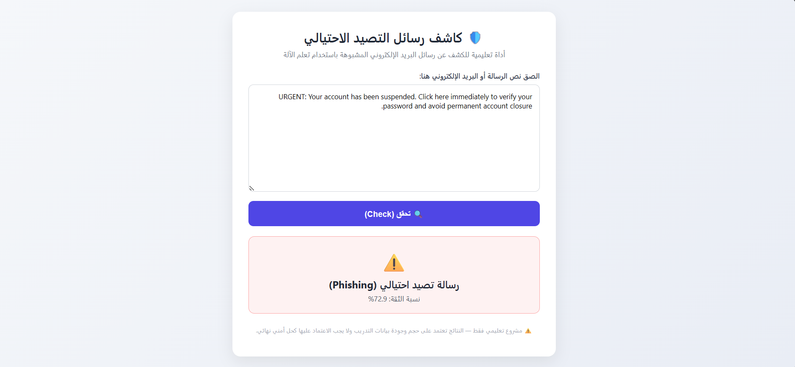
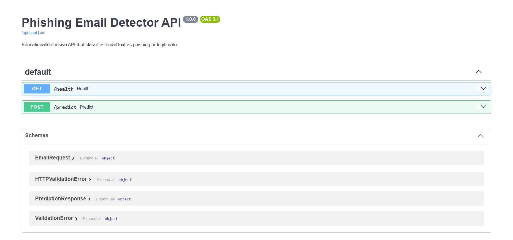

# 🛡️ Phishing Email Detector

A machine-learning based system for detecting potentially phishing emails by classifying email text as **Phishing** or **Legitimate**.

The project combines a Scikit-learn machine learning model with a FastAPI backend and a simple web interface for testing email messages.

> ⚠️ **Educational Project:** This project is developed for educational and defensive cybersecurity purposes. It is not intended to replace professional email security solutions.

---

## 🚀 Project Overview

Phishing attacks are one of the most common cybersecurity threats, often using urgent or deceptive messages to trick users into revealing sensitive information.

This project demonstrates how machine learning can be used to analyze email text and identify suspicious patterns.

The system accepts email content as input and returns:

- 🛡️ **Phishing** — potentially malicious or suspicious email
- ✅ **Legitimate** — likely legitimate email
- 📊 **Confidence Score** — model confidence for the prediction

---

## 🎯 Objectives

- Detect phishing email messages using machine learning.
- Apply text preprocessing and feature extraction techniques.
- Compare multiple classification algorithms.
- Build a REST API using FastAPI.
- Create a simple web interface for testing.
- Demonstrate an end-to-end machine learning cybersecurity application.

---

## 🧠 Machine Learning Approach

The project uses classical machine learning techniques for text classification.

### Text Processing

Email text is transformed into numerical features using:

**TF-IDF (Term Frequency–Inverse Document Frequency)**

The model uses:

- Unigrams
- Bigrams
- English stop-word filtering

### Classification Models

Three machine learning algorithms are evaluated:

1. Logistic Regression
2. Multinomial Naive Bayes
3. Linear Support Vector Machine (Linear SVM)

The models are compared using **F1-score**, and the best-performing model is selected.

---

## 🏗️ System Architecture

```text
                 ┌──────────────────────┐
                 │     Web Interface    │
                 │    HTML / CSS / JS    │
                 └──────────┬───────────┘
                            │
                            ▼
                 ┌──────────────────────┐
                 │     FastAPI API      │
                 │   POST /predict      │
                 └──────────┬───────────┘
                            │
                            ▼
                 ┌──────────────────────┐
                 │   Machine Learning   │
                 │      Model           │
                 │   TF-IDF + Classifier│
                 └──────────┬───────────┘
                            │
                            ▼
                 ┌──────────────────────┐
                 │ Phishing / Legitimate│
                 │   + Confidence Score │
                 └──────────────────────┘
```

---

## 📁 Project Structure

```text
phishing-email-detector/
│
├── model/
│   ├── train_model.py
│   ├── dataset.csv
│   └── model.pkl
│
├── backend/
│   ├── main.py
│   └── requirements.txt
│
├── frontend/
│   ├── index.html
│   ├── style.css
│   └── script.js
│
├── screenshots/
│   ├── 01-phishing-detection.png
│   ├── 02-legitimate-detection.png
│   └── 03-api-documentation.png
│
└── README.md
```

---

## 🛠️ Technologies


---

## ⚙️ Installation

### 1. Clone the repository

```bash
git clone https://github.com/Hanen-code/phishing-email-detector.git
cd phishing-email-detector
```

### 2. Install dependencies

Navigate to the backend directory:

```bash
cd backend
```

Install the required Python packages:

```bash
pip install -r requirements.txt
```

---

## 🧪 Train the Model

Navigate to the model directory:

```bash
cd ../model
```

Run:

```bash
python train_model.py
```

This trains the machine learning models and generates the saved model:

```text
model.pkl
```

---

## ▶️ Run the Backend

Navigate to the backend directory:

```bash
cd ../backend
```

Start the FastAPI server:

```bash
uvicorn main:app --reload --host 0.0.0.0 --port 8000
```

The API will be available at:

```text
http://127.0.0.1:8000
```

---

## 🌐 Run the Frontend

Open:

```text
frontend/index.html
```

using a local web server such as **Live Server**.

The interface allows users to enter an email message and send it to the FastAPI backend for classification.

---

## 🔌 API Endpoints

### Health Check

```http
GET /health
```

Example response:

```json
{
  "status": "ok",
  "model_loaded": true
}
```

---

### Predict Email

```http
POST /predict
```

Example request:

```json
{
  "text": "URGENT: Your account has been suspended. Click here to verify your password."
}
```

Example response:

```json
{
  "prediction": "Phishing",
  "confidence": 0.729
}
```

---

## 📸 Screenshots

### 🛡️ Phishing Detection

The system identifies a suspicious email as **Phishing** and displays the confidence score.



---

### ✅ Legitimate Email Detection

The system classifies a normal email as **Legitimate**.


---

### 🔌 FastAPI Documentation

Interactive API documentation is available through Swagger UI.



---

## 📊 Dataset

The project uses a **synthetically generated educational dataset** containing approximately **180 email samples**.

The dataset is intentionally limited and is used to demonstrate the machine learning workflow rather than to provide production-level phishing detection.

---

## ⚠️ Limitations

This project has several limitations:

- The dataset is relatively small.
- The dataset is synthetically generated.
- Some language patterns may be repeated.
- The model may rely on keywords and common phishing patterns.
- Performance may decrease when analyzing real-world emails with unfamiliar patterns.
- The system should not be considered a replacement for professional email security solutions.

---

## 🔐 Security Considerations

The project is designed for educational and defensive purposes.

It demonstrates how machine learning can support phishing awareness and detection without interacting with real malicious infrastructure or real user accounts.

---

## 🎓 Academic Project

This project demonstrates practical skills in:

- Machine Learning
- Natural Language Processing
- Cybersecurity
- Python
- Scikit-learn
- FastAPI
- REST APIs
- Frontend Development
- Model Evaluation

---

## 👩‍💻 Author

**Hanen Alahmari**

Information Technology Student | Cybersecurity Enthusiast

[GitHub](https://github.com/Hanen-code) • [LinkedIn](https://www.linkedin.com/in/hanen-alahmari-it)

---

⭐ If you find this project useful, feel free to explore the repository.
